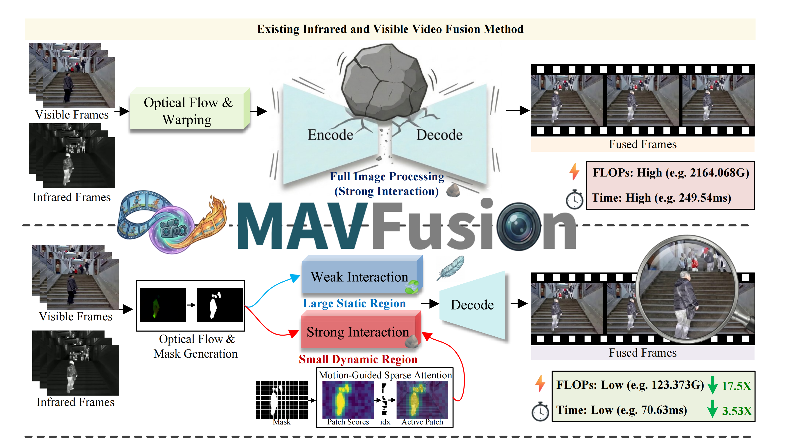
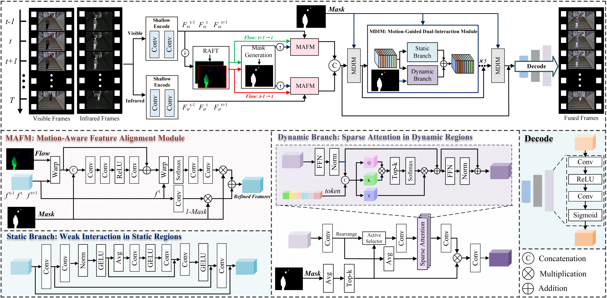

<div align="center">

# (ECCV 26) MAVFusion: Efficient Infrared and Visible Video Fusion via Motion-Aware Sparse Interaction

[](https://arxiv.org/pdf/2604.01958)
[](LICENSE)

Xilai Li<sup>1*</sup> · 
Weijun Jiang<sup>2*</sup> · 
Xiaosong Li<sup>1†</sup> · 
Yang Liu<sup>1</sup> · 
Hongbin Wang<sup>2</sup> · 
Tao Ye<sup>3</sup> · 
Huafeng Li<sup>2</sup> · 
Haishu Tan<sup>1</sup>

<sup>1</sup>Foshan University · <sup>2</sup>Kunming University of Science and Technology · <sup>3</sup>China University of Mining and Technology

---

</div>

## 🎯 Overview

<div align="center">
  
  <p><i>MAVFusion decouples static and dynamic regions for efficient video fusion, achieving <b>14.16 FPS</b> at 640×480 with state-of-the-art quality.</i></p>
</div>

**MAVFusion** addresses the critical challenge of temporal consistency in infrared-visible video fusion. Unlike existing methods that apply uniform attention across all regions, we leverage **optical flow to identify dynamic regions** and allocate computation efficiently:

- 🔥 **Dynamic regions**: Top-K sparse attention for salient motion
- 🌳 **Static regions**: Lightweight depthwise separable convolutions
- ⚡ **Result**: 14.16 FPS @ 640×480 with superior fusion quality

<div align="center">
  
  <p><i>Network architecture: MAFM for temporal alignment + MDIM for motion-guided dual interaction.</i></p>
</div>

---

## ✨ Key Features

- **Motion-Aware Feature Alignment Module (MAFM)**: Coarse-to-fine flow warping with cross-modal residual refinement and motion-mask-gated temporal aggregation
- **Motion-Guided Dual-Interaction Module (MDIM)**: Separate branches for static textures and dynamic salient regions
- **Efficient sparse attention**: Top-K patch selection (τ=0.3) reduces computation while maintaining long-range dependencies

---

## 🚀 Quick Start

### Installation

```bash
git clone https://github.com/lixilai/MAVFusion.git
cd MAVFusion
pip install -r requirements.txt
```

**Requirements**: Python 3.10, PyTorch 2.x, CUDA 12.8+ (tested on RTX 4090)

### Download Pretrained Weights

### Download Pretrained Weights

#### 1. SEA-RAFT optical flow model (automated)

```bash
bash src/script/download_searaft_ckpt.sh
```

This will download the SEA-RAFT checkpoint automatically.

#### 2. MAVFusion pretrained model (manual download required)

The MAVFusion checkpoint can be downloaded separately from Google Drive:

**Download link**: [MAVFusion model.pth (Google Drive)](https://drive.google.com/file/d/1KHRmjEUWVAKDQEZJdwIWA6ob32xF3__7/view?usp=sharing)

**Installation steps**:

```bash
# 1. Download model.pth from the Google Drive link above

# 2. Create the checkpoint directory
mkdir -p checkpoint/latest

# 3. Move the downloaded file to the correct location
mv ~/Downloads/model.pth checkpoint/latest/model.pth

# 4. Verify the file exists
ls -lh checkpoint/latest/model.pth
```

**Alternative: Download via gdown (if you have it installed)**:

```bash
pip install gdown
mkdir -p checkpoint/latest
gdown 1KHRmjEUWVAKDQEZJdwIWA6ob32xF3__7 -O checkpoint/latest/model.pth
```

### Inference

#### Option 1: Test on prepared datasets

```bash
python test.py --exp_path MAVFusion-M3SVD \
    --dataset_name M3SVD \
    --base_data_dir ./data2
```

#### Option 2: Test on your own data (auto-preparation)

**Data format requirement**: Your data must follow this structure:

```
/path/to/MyDataset/               # ← Directory name should match --raw_dataset_name
├── seq_001/                      # ← One or more sequence directories
│   ├── infrared/                 # ← Must use "infrared" or "ir"
│   │   ├── 000000.jpg
│   │   ├── 000001.jpg
│   │   └── ...
│   └── visible/                  # ← Must use "visible" or "rgb"
│       ├── 000000.jpg
│       ├── 000001.jpg
│       └── ...
├── seq_002/
│   ├── infrared/
│   └── visible/
└── ...
```

**Important notes**:
- Modality folders **must** be named `infrared`/`visible` (or `ir`/`rgb`/`vi`). Other names like `gt_infrared` will not work.
- The parent directory name (e.g., `MyDataset`) should match `--raw_dataset_name`.
- Frame filenames should match between modalities and sort correctly (e.g., `000000.jpg`, `000001.jpg`).

**Command**:

```bash
python test.py --exp_path MAVFusion-M3SVD \
    --dataset_name MyDataset \
    --raw_data_dir /path/to/MyDataset/ \
    --raw_dataset_name MyDataset \
    --force_prep
```

This will:
1. Auto-generate train/test split (80/20 by default)
2. Create CSV index files in `data_split/IVF/MyDataset/`
3. Generate dataset config in `config/dataset/IVF/MyDataset/`
4. Run inference on the test split

**Output**: Fused frames saved to `output/MAVFusion-M3SVD/test_results/latest/eval_visual/IVF-MyDataset/fused_result/`

#### Special case: Single sequence testing

If you have only **one sequence** and want to test on it (not split into train/test), use manual preparation:

```bash
# Step 1: Organize your data (rename modality folders if needed)
# Your data should look like:
#   /path/to/MyDataset/
#   └── seq_001/
#       ├── infrared/000000.jpg ...
#       └── visible/000000.jpg ...

# Step 2: Generate dataset files
python tools/prepare_dataset.py \
    --source /path/to/MyDataset \
    --dataset-name MyDataset \
    --explicit-test seq_001 \
    --force

# Step 3: Run inference
python test.py --exp_path MAVFusion-M3SVD \
    --dataset_name MyDataset \
    --base_data_dir /path/to/
```

Replace `seq_001` with your actual sequence directory name, and ensure the parent directory name matches `--dataset-name`.

**Example with real data**:

```bash
# Given: /data/Video_Test/gt_infrared/0112_1732/*.jpg
#        /data/Video_Test/gt_visible/0112_1732/*.jpg

# 1. Create compliant structure with symlinks (no file copying)
mkdir -p /data/MyDataset/seq_0112_1732/{infrared,visible}
ln -s /data/Video_Test/gt_infrared/0112_1732/*.jpg /data/MyDataset/seq_0112_1732/infrared/
ln -s /data/Video_Test/gt_visible/0112_1732/*.jpg  /data/MyDataset/seq_0112_1732/visible/

# 2. Prepare dataset
python tools/prepare_dataset.py \
    --source /data/MyDataset \
    --dataset-name MyDataset \
    --explicit-test seq_0112_1732 \
    --force

# 3. Run inference
python test.py --exp_path MAVFusion-M3SVD \
    --dataset_name MyDataset \
    --base_data_dir /data/

# Output: 51 fused frames in output/MAVFusion-M3SVD/test_results/latest/eval_visual/IVF-MyDataset/fused_result/
```

### Training

#### Option 1: Train on prepared datasets (M3SVD, HDO, VTMOT)

```bash
# Make sure your data is organized under data2/ as shown in the Dataset section
python train.py --base_data_dir ./data2 --no_wandb
```

The default config trains on M3SVD. To use a different dataset, modify `config/train/ivf-train.yaml`.

#### Option 2: Train on your own data (auto-preparation)

```bash
# Your data should follow the structure:
#   /path/to/MyDataset/
#   ├── seq_001/
#   │   ├── infrared/000000.jpg ...
#   │   └── visible/000000.jpg ...
#   ├── seq_002/
#   └── ...

python train.py \
    --raw_data_dir /path/to/MyDataset/ \
    --raw_dataset_name MyDataset \
    --no_wandb \
    --force_prep
```

This will:
1. Auto-generate train/test split (default 80/20)
2. Create dataset config files
3. Start training immediately

**Training outputs**:
- Checkpoints: `output/<timestamp>-IVF-*/checkpoint/`
- TensorBoard logs: `output/<timestamp>-IVF-*/tensorboard/`
- Visualization samples: `output/<timestamp>-IVF-*/visualization/`

**Advanced options**:

```bash
# Custom train/test ratio
python train.py \
    --raw_data_dir /path/to/MyDataset/ \
    --raw_dataset_name MyDataset \
    --raw_train_ratio 0.9 \
    --no_wandb

# Resume from checkpoint
python train.py \
    --resume_run output/26_06_23-10_24_17-IVF-*/checkpoint/latest \
    --no_wandb

# Mixed precision training (faster, less memory)
python train.py \
    --base_data_dir ./data2 \
    --mixed_precision bf16 \
    --no_wandb
```

**Important notes**:
- The `--no_wandb` flag disables Weights & Biases logging. Remove it if you want to use W&B (requires `wandb login` first).
- If you have only one sequence, it will be assigned to the training set by default. Use manual preparation (see Dataset section below) to control train/test splits.
- Training requires at least 16GB GPU memory (tested on RTX 4090). Reduce batch size in config if OOM occurs.

---

## 📂 Dataset

We evaluate on three public benchmarks:

- **M3SVD** (30 sequences) - Multi-modal surveillance
- **HDO** (24 sequences) - High-dynamic outdoor scenes  
- **VTMOT** (90 sequences) - Vehicle tracking benchmark

Expected structure:
```
data2/
├── M3SVD/
│   ├── seq_001/
│   │   ├── infrared/000000.png ...
│   │   └── visible/000000.png ...
│   ├── seq_002/
│   └── ...
├── HDO/
└── VTMOT/
```

### Preparing your own dataset

If your data is in a different layout (e.g., `<root>/<modality>/<seq>/`), use the preparation tool:

```bash
python tools/prepare_dataset.py \
    --source /path/to/raw/data \
    --dataset-name MyDataset \
    --modality-dirs infrared visible \
    --layout auto \
    --force
```

Available options:
- `--layout`: `seq-first` (default, `<seq>/<modality>/`), `mod-first` (`<modality>/<seq>/`), or `auto` (detect)
- `--modality-dirs`: Two directory names for your modalities (default: `infrared visible`)
- `--train-ratio`: Train/test split ratio (default: 0.8)
- `--explicit-test`: Comma-separated sequence names to force into test split
- `--file-ext`: Image extension (default: `.jpg`)

---

## 🎬 Demo

Run the demo script to generate a fused video:

```bash
# 1. Prepare a demo sequence under ./data/ 
#    (e.g., VTMOT-demo/{infrared,visible}/)

# 2. Generate fused video
python test_demo.py --exp_path MAVFusion-M3SVD \
    --dataset_name VTMOT-demo --fps 24 --bitrate 50000
```

Output: `output_demo/VTMOT-demo/fused_result.mp4`

---

## 📝 Citation

If you find MAVFusion useful in your research, please cite:

```bibtex
@article{li2026mavfusion,
  title={MAVFusion: Efficient Infrared and Visible Video Fusion via Motion-Aware Sparse Interaction},
  author={Li, Xilai and Jiang, Weijun and Li, Xiaosong and Liu, Yang and Wang, Hongbin and Ye, Tao and Li, Huafeng and Tan, Haishu},
  journal={arXiv preprint arXiv:2604.01958},
  year={2026}
}
```

---

## 🙏 Acknowledgments

This work builds upon excellent prior research:

- **[SEA-RAFT](https://github.com/princeton-vl/SEA-RAFT)** for optical flow estimation
- **[UniVF](https://github.com/Zhaozixiang1228/VF-Bench)** for training scaffolding and evaluation framework

---

## 📄 License

This project is released under the [MIT License](LICENSE).

<div align="center">
  <sub>Built with ❤️ by the MAVFusion team</sub>
</div>
